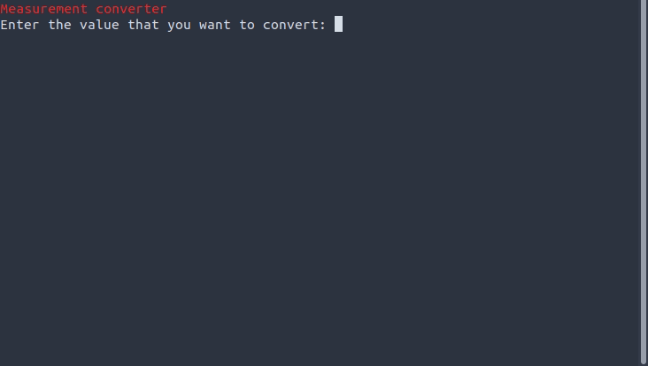

## Measurement converter

### A python measure converter with more than 40 conversions. Can be used in other projects or just normal use

---
## Working

### In the first input you enter the value, for example 90. Then you enter the measurement of the 90, for example 90lb. In the third input enter the measure you want to convert to, for example if you want to convert 90lb to kg, now enter kg.

---

## Possible conversions

- km to mi
- km to m
- mi to km
- mi to m
- m to yd
- m to ft
- m to in
- yd to m
- ft to m
- in to m
- l to gal
- l to oz
- gal to l
- gal to oz
- oz to l
- oz to gal
- kg to lb
- kg to ounce
- lb to kg
- lb to ounce
- ounce to kg
- ounce to lb
- m^2 to yr^2
- m^2 to ft^2
- m^2 to in^2
- yr^2 to m^2
- yr^2 to ft^2
- yr^2 to in^2
- ft^2 to m^2
- ft^2 to yr^2
- ft^2 to in^2
- in^2 to ft^2
- km/h to mph
- km/h to knot
- mph to km/h
- mph to knot
- knot to km/h
- knot to mph
- km/s to km/h
- km/s to mph
- km/s to knot

### If you want, you can volunteer to add more conversions. Create an feature request on issues section.

---

## Table 

- km = kilometers
- mi = miles
- m = meters
- yd = yard
- ft = feet
- in = inch
- l = liters
- gal = gallons
- oz = fluid ounce
- kg = kilograms
- lb = pounds
- ounce = ounce
- km/h = kilometers per hour
- mph = miles per hour
- knot = knot
- km/s = kilometers per second

---

Made by [André V.](https://github.com/Dedsd)